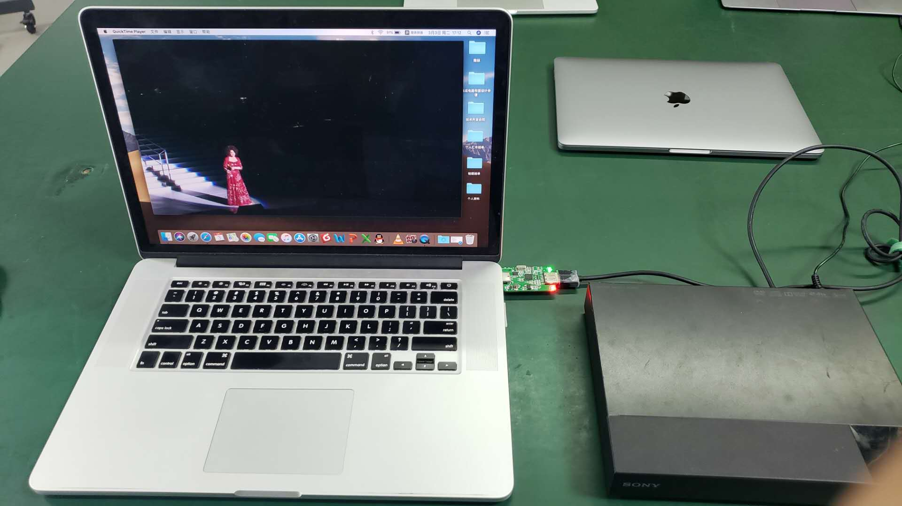

# brief

+ USB Host HardWare: MacPro 
+ USB Host OS: macOS 10.14.6
+ USB Host App: QuickTime
+ DUT : USB HDMI Capture
+ HDMI Source : Sony BDP-1500

+ Picture
   

+ Video
<video id="video" controls="" preload="none" poster="">
      <source id="mp4" src="" type="video/mp4">
</video>